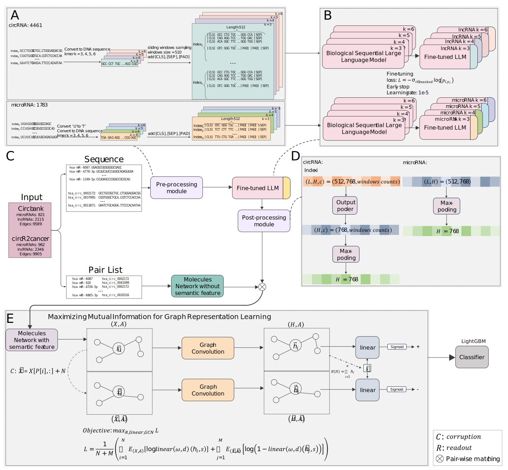

# Predicting-circRNA-microRNA-Interactions-via-Knowledge-Graph-based-Large-Language-Model
===========================================================================


[](https://www.python.org/)
[](https://pytorch.org/)


The interactions between circRNAs and microRNAs are one of the key mechanisms determining the functions in biological processes such as DNA methylation and RNA-induced silencing. Studying these relationships can deepen our understanding of the function of non-coding RNAs' roles in developing cancer vaccines and design treatments. Therefore,we proposed a computational method for predicting circRNA-miRNA interacrtions based on the knowledge graph enhanced pretrained large language model (LLM). The pretrained sequential LLM was trained by sequences of circRNAs and microRNAs separately to generate the semantic representation for the entities of circRNAs and microRNAs, then the graph contrastive learning was employed to generate the embedding which can represent the relationships among the knowledge graph formed by circRNAs and microRNAs from multi-view. At the final, the embedding was fed into classifier for prediction. An independent test were set to evaluate the model's performance as the remaining dataset was performed cross-validation test method's stability. The benchmark was against our model with recently reported models on two datasets. Our model achieved approximately a 3\% improvement in Area Under the Receiver Operating Characteristic Curve (AUROC), reaching 93.77\% and 93.07\%, respectively. In ablation study, we comprehensively compared  strategies for sequence processing and effectiveness of independent module. Finally, we deployed our model on an augmented dataset for a case study. Among the top ten predicted results, seven validated outcomes which can demonstrate the effectiveness of our approach in practical scenarios.


(Fig. 1.)


Our framework, as shown in Fig. 1., begins by categorizing sequences into two different types, circRNA and microRNA, each undergoing distinct pre-processing modules. These are then input into a BERT model trained under corresponding k settings on DNA sequences. We fine-tune each model separately using a per-word loss approach, resulting in eight language models. Following this, we use the respective models to obtain sequence representations. We introduce negative perturbations to the network by adding Gaussian noise to nodes and creating negative edges to disrupt the original connections. Both the perturbed and original networks are then encoded using graph convolutional layers. For the original graph encoding, we employ global pooling to capture global features. Subsequently, we combine these with two types of local features in a linear layer for evaluation and use a method to maximize mutual information to obtain node embeddings. This process results in node embeddings that represent both global and local information effectively.
## Table of Contents

- [Installation](#installation)
- [Quick start](#quick-start)
- [Contributing](#contributing)
- [Cite](#cite)
- [Contacts](#contacts)
- [License](#license)


## Installation

Our method is tested to work under:

```
* Python 3.8.0
* Torch 1.12.0
* Numpy 1.23.5
* Other basic python toolkits
```
### Installation of other dependencies
* Install [Networkx](https://networkx.github.io/) using ` $ pip install networkx `
* Install [PyG](https://pypi.org/project/torch-geometric/) using ` $ pip install torch-geometric `
* Install [lightGBM](https://lightgbm.readthedocs.io/en/stable/) run the following commands in cmd:
```
git clone --recursive https://github.com/microsoft/LightGBM
cd LightGBM
mkdir build
cd build
cmake -A x64 ..
cmake --build . --target ALL_BUILD --config Release
```
* Install [scikit-learn]https://scikit-learn.org/stable/) using '$ pip install -U scikit-learn'

# Quick start
To reproduce our results:

## 1，infer ligand–receptor (L-R) pairs from single-cell RNA sequencing data
```
cellphonedb method statistical_analysis ./data/RCC_scRNA_P76_metadata.txt ./data/RCC_scRNA_P76_matrix.txt --counts-data=gene_name --threads 100 --output-path ./output/
```
**Arguments**:

| **Arguments** | **Detail** |
| --- | --- |
| **counts-data** | [ensembl or gene_name or hgnc_symbol] |
| **threads** | Max of threads to process the data. |
| **output-path** | Directory where the results will be allocated (the directory must exist). |

```
Rscript ./tools/run_cellchat.R --count ./data/RCC_scRNA_P76_matrix.txt --meta ./data/RCC_scRNA_P76_metadata.txt  --output ./output/

# The used ligand-target matrix, lr network and weighted networks of interacting cells can be downloaded from [Zenodo](https://zenodo.org/record/7074291).
Rscript ./tools/run_nichenet.R --count ./data/RCC_scRNA_P76_matrix.txt --meta ./data/RCC_scRNA_P76_metadata.txt  --output ./output/

Rscript ./tools/run_icellnet.R --count ./data/RCC_scRNA_P76_matrix.txt --meta ./data/RCC_scRNA_P76_metadata.txt  --output ./output/
```
**Arguments**:

| **Arguments** | **Detail** |
| --- | --- |
| **count** | Count matrix / normalized count matrix path. |
| **meta** | Meta data (celltypes annotation) path. |
| **output** | Directory where the results will be allocated. |

```
# Obtain the intersection of LR pairs output by 4 cellular communication tools, which are required to be found by at least 2 tools and have expression in scRNA-seq data.
python ./tools/process_final_lr.py --lr_cellphonedb ./output/process_cellphonedb_lr.csv --lr_cellchat ./output/process_cellchat_lr.csv --lr_nichenet ./output/process_nichenet_lr.csv --lr_icellnet ./output/process_icellchat_lr.csv --count ./data/RCC_scRNA_P76_matrix.txt --output ./output/final_lr.csv
```
**Arguments**:

| **Arguments** | **Detail** |
| --- | --- |
| **lr_cellphonedb** | The results of LR pairs output by cellphonedb. |
| **lr_cellchat** | The results of LR pairs output by cellchat. |
| **lr_nichenet** | The results of LR pairs output by nichenet. |
| **lr_icellnet** | The results of LR pairs output by icellnet. |
| **count** | Count matrix / normalized count matrix path. |
| **output** | The final results of LR pairs. |

## 2，prioritize the dominant cell communication assmebly that regulates the target gene expression pattern
```
python ./src/tutorials1/main.py --count ./data/RCC_scRNA_P76_matrix.txt --meta ./data/RCC_scRNA_P76_metadata.txt --lr_file ./output/final_lr.csv --gene CD8A --dca_rank_result ./output/CD8A_dca_rank_result.csv --ccc_ratio_result ./output/CD8A_ccc_ratio_result.csv
```
**Arguments**:

| **Arguments** | **Detail** |
| --- | --- |
| **count** | Count matrix / normalized count matrix path. |
| **meta** | Meta data (celltypes annotation) path. |
| **lr_file** | The final results of LR pairs. |
| **gene** | The specific target gene name  |
| **dca_rank_result** | The result of prioritize the dominant cell communication assmebly that regulates the target gene expression pattern. |
| **ccc_ratio_result** | The result of ratio of different cell types affected by cellular communication. |

Visualization of results:
<div align="center">
  
</div>

===========================================================================

<div align="center">
  
</div>

## 3，prioritize the dominant cell communication assmebly that regulates the key factors in specific cell type
```
python ./src/tutorials2/main.py --count ./data/RCC_scRNA_P76_matrix.txt --meta ./data/RCC_scRNA_P76_metadata.txt --lr_file ./output/final_lr.csv --gene FOLR2 --cell_type TAM --dca_rank_result ./output/FOLR2_dca_rank_result.csv --ccc_ratio_result ./output/FOLR2_ccc_ratio_result.csv
```
**Arguments**:

| **Arguments** | **Detail** |
| --- | --- |
| **count** | Count matrix / normalized count matrix path. |
| **meta** | Meta data (celltypes annotation) path. |
| **lr_file** | The final results of LR pairs. |
| **gene** | The specific target gene name.  |
| **cell_type** | The specific cell type (TAM:tumor-associated macrophages).  |
| **dca_rank_result** | The result of prioritize the dominant cell communication assmebly that regulates the target gene expression pattern. |
| **ccc_ratio_result** | The result of ratio of different cell types affected by cellular communication. |

Visualization of results:
<div align="center">
  
</div>

## 4，prioritize the dominant cell communication assmebly that affected functional states of malignant cells
```
python ./src/tutorials3/main.py --count ./data/RCC_scRNA_P76_matrix.txt --meta ./data/RCC_scRNA_P76_metadata.txt --lr_file ./output/final_lr.csv --cell_type Malignant --cell_state EMT --dca_rank_result ./output/state_dca_rank_result.csv
```
**Arguments**:

| **Arguments** | **Detail** |
| --- | --- |
| **count** | Count matrix / normalized count matrix path. |
| **meta** | Meta data (celltypes annotation) path. |
| **lr_file** | The final results of LR pairs. |
| **cell_type** | The specific cell type.  |
| **cell_state** | [Angiogenesis; Apoptosis; CellCycle; Differentiation; DNAdamage; DNArepair; EMT; Hypoxia; Inflammation; Invasion; Metastasis; Proliferation; Quiescence; Stemness.]  |
| **dca_rank_result** | The result of prioritize the dominant cell communication assmebly that affected functional states of malignant cells. |


Visualization of results:
<div align="center">
  
</div>

## 5，clinical intervertion altered effect of cell communication on gene expression
```
python ./src/tutorials1/main.py --count ./data/RCC_scRNA_P915_matrix.txt --meta ./data/RCC_scRNA_P915_metadata.txt --lr_file ./output/final_lr.csv --gene CD8A --dca_rank_result ./output/P915_CD8A_dca_rank_result.csv --ccc_ratio_result ./output/P915_CD8A_ccc_ratio_result.csv
```
**Arguments**:

| **Arguments** | **Detail** |
| --- | --- |
| **count** | Count matrix / normalized count matrix path. |
| **meta** | Meta data (celltypes annotation) path. |
| **lr_file** | The final results of LR pairs. |
| **gene** | The specific target gene name  |
| **dca_rank_result** | The result of prioritize the dominant cell communication assmebly that regulates the target gene expression pattern. |
| **ccc_ratio_result** | The result of ratio of different cell types affected by cellular communication. |

Visualization of results:
<div align="center">
  
</div>

===========================================================================


# Contributing

Jiboya Xuliwen ..

# Cite
<p align="center">
  <a href="https://clustrmaps.com/site/1bpq2">
     
   </a>
</p>

<p align="center">
  <a href="#">
     
   </a>
</p>


# Contacts
If you have any questions or comments, please feel free to email: byj@hnu.edu.cn.

# License

[MIT ? Richard McRichface.](../LICENSE)
