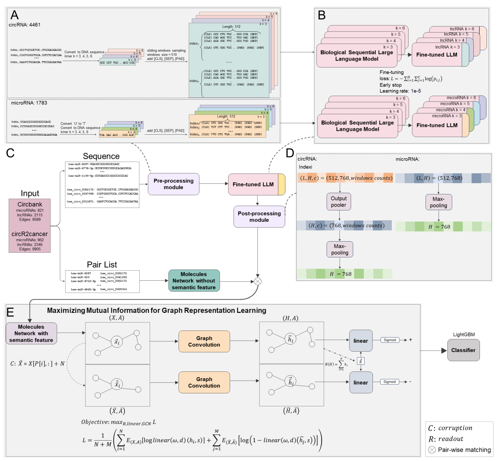

# Predicting-circRNA-microRNA-Interactions-via-Knowledge-Graph-based-Large-Language-Model
===========================================================================


[](https://www.python.org/)
[](https://pytorch.org/)


The interactions between circRNAs and microRNAs are one of the key mechanisms determining the functions in biological processes such as DNA methylation and RNA-induced silencing. Studying these relationships can deepen our understanding of the function of non-coding RNAs' roles in developing cancer vaccines and design treatments. Therefore,we proposed a computational method for predicting circRNA-miRNA interacrtions based on the knowledge graph enhanced pretrained large language model (LLM). The pretrained sequential LLM was trained by sequences of circRNAs and microRNAs separately to generate the semantic representation for the entities of circRNAs and microRNAs, then the graph contrastive learning was employed to generate the embedding which can represent the relationships among the knowledge graph formed by circRNAs and microRNAs from multi-view. At the final, the embedding was fed into classifier for prediction. An independent test were set to evaluate the model's performance as the remaining dataset was performed cross-validation test method's stability. The benchmark was against our model with recently reported models on two datasets. Our model achieved approximately a 3\% improvement in Area Under the Receiver Operating Characteristic Curve (AUROC), reaching 93.77\% and 93.07\%, respectively. In ablation study, we comprehensively compared  strategies for sequence processing and effectiveness of independent module. Finally, we deployed our model on an augmented dataset for a case study. Among the top ten predicted results, seven validated outcomes which can demonstrate the effectiveness of our approach in practical scenarios.


(Fig. 1.)


Our framework, as shown in Fig. 1., begins by categorizing sequences into two different types, circRNA and microRNA, each undergoing distinct pre-processing modules. These are then input into a BERT model trained under corresponding k settings on DNA sequences. We fine-tune each model separately using a per-word loss approach, resulting in eight language models. Following this, we use the respective models to obtain sequence representations. We introduce negative perturbations to the network by adding Gaussian noise to nodes and creating negative edges to disrupt the original connections. Both the perturbed and original networks are then encoded using graph convolutional layers. For the original graph encoding, we employ global pooling to capture global features. Subsequently, we combine these with two types of local features in a linear layer for evaluation and use a method to maximize mutual information to obtain node embeddings. This process results in node embeddings that represent both global and local information effectively.
## Table of Contents

- [Installation](#installation)
- [Quick start](#quick-start)
- [Contributing](#contributing)
- [Cite](#cite)
- [Contacts](#contacts)
- [License](#license)


## Installation

Our method is tested to work under:

```
* Python 3.8.0
* Torch 1.12.0
* Numpy 1.23.5
* Other basic python toolkits
```
### Installation of other dependencies
* Install [Networkx](https://networkx.github.io/) using ` $ pip install networkx `
* Install [PyG](https://pypi.org/project/torch-geometric/) using ` $ pip install torch-geometric `
* Install [lightGBM](https://lightgbm.readthedocs.io/en/stable/) run the following commands in cmd:
```
git clone --recursive https://github.com/microsoft/LightGBM
cd LightGBM
mkdir build
cd build
cmake -A x64 ..
cmake --build . --target ALL_BUILD --config Release
```
* Install [scikit-learn]https://scikit-learn.org/stable/) using '$ pip install -U scikit-learn'

# Quick start
To reproduce our results:

## 1，Pre-processing the sequence into the required format
```
cd ./k_difference
python3 preprocessing.py
```
**Arguments**:
| **Arguments** | **Detail** |
| --- | --- |
| **k_lst** | The required k-value to be selected |
| **windows_size** | sliding_windows size, default as 510 |
| **step** | sliding_windows step, default as 50 |


## 2，fine-tuning the models
```
cd ./k_difference
python3 fine_tune.py
```
**Arguments**:
| **Arguments** | **Detail** |
| --- | --- |
| **Early_stop** | Early_stop settings, default as 5 |
| **max_sequences** | max_sequences per batch which should be setting sue to the gpu memory, default as 600 |
| **gpu_counts** | gpu used for training, default as 2 |
| **models** | The list of pretrained model for fine-tuning, default as [3, 4, 5, 6] |

## 3，Using fine-tuned model to extract sequences and post-process the vector by multiple-pooling strategy
```
cd ./k_difference
python3 feature_extraction.py
```
**Arguments**:
| **Arguments** | **Detail** |
| --- | --- |
| **pooling strategy** | The strategy for pooling the circRNA vector where the choices are global average pooling, global Max pooling, default as global Max pooling |
| **gpu_counts** | gpu used for training, default as 2 |
| **models** | The list of pretrained model for fine-tuning, default as [3, 4, 5, 6] |

## 4，Embed using graph contrastive after pairwise matching of semantic features with network structures
```
cd ./graph_feature
python3 results.py
```
**Arguments**:

| **Arguments** | **Detail** |
| --- | --- |
| **Early_stop** | Early stop, default as 300|
| **learning_rate** | default as 1E-5 |

## 5，Visualization of results:
There are mutliple choices for visualize the results.
'''
python3  Plot.py -p boxplot
'''
(Fig. 2.)


# Contributing

Jiren Zhou

# Contacts
If you have any questions or comments, please feel free to email: zhoujiren@nwpu.edu.cn.

# License

[MIT ? Richard McRichface.](../LICENSE)
